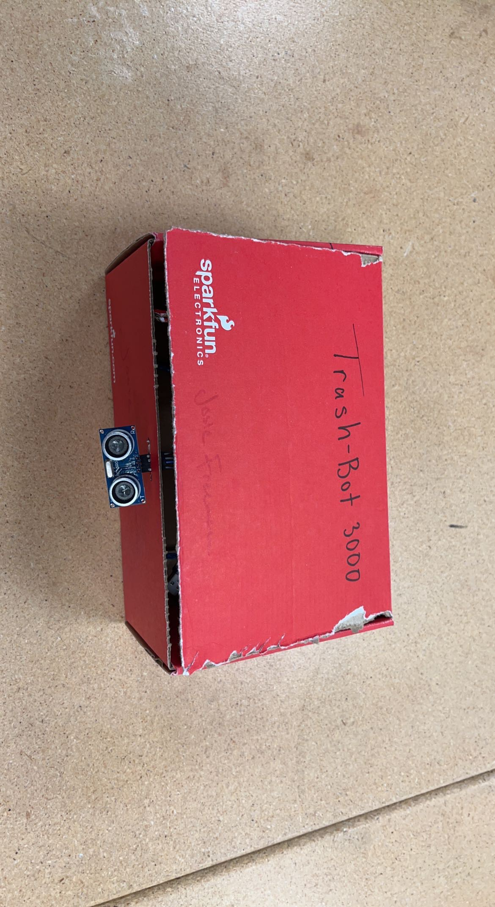
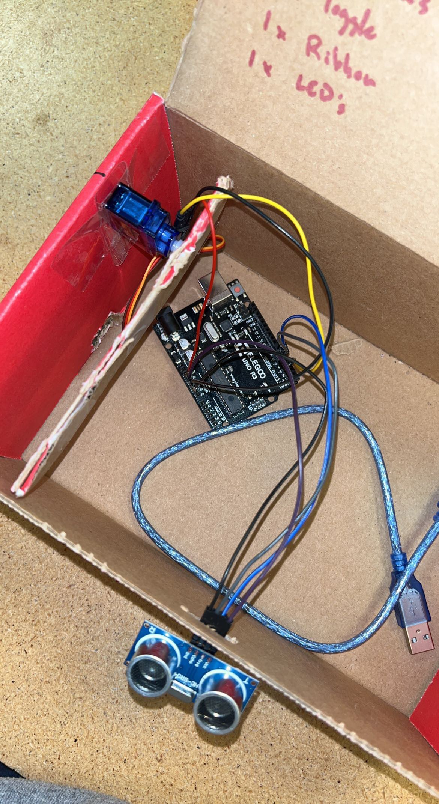

# Trashbot

## Arduino Project

The application that we have chosen to develop is a motion censored trash can. This trashcan picks up motion in front of the  trashcan and then opens the lid for the user to throw away their garbage. It is a useful application because you can use it in the real world and it is similar to the trash cans that you open with your feet. This trash can allows you to not have to do any extra work and just lets you throw stuff away.

Here is the link to the website we used to help complete the wiring and create the code:
<https://projecthub.arduino.cc/ashraf_minhaj/c81effad-d583-40bb-9d20-808803efbdf2>

Below is an image from the tutorial that we used to base our wiring off of. The only difference we had was the port that has two wirings going into a singular port, we split those up and put the motor on the port with the lesser voltage.

Below is an image of what our final project looks like from the outside:

Below is an image of all of the connections we made between the motor and the sensor to the Arduino board. This is a little messy which is why we included the tutorial photo of the wires.

## Agent

Based on the definition of an agent, our trash can acts as an agent because it is acting based on its environment. Our trash can has sensors that allow it to react to the environment. It is self-aware because it has the motion sensors in the front and it is reactive and social behavior. These are all characteristics of agents that our trash can displays when being used. Our agent is a simple reflex agent because all it is doing is using the motion sensors to open the trash can with human interaction. Our agent would not be considered rational because it is only using sensors and isn't acting based on performance measures. The performance measure is how well the motor opens up the trash can and how safe it is. If the sensor is picking up motion when we want it to and then opens the trashcan efficiently, then that is a way we can evaluate the performance. The environment would be in peoples home's or rooms where the trash can is, and the area or situation right in front of the sensor. The actuators would be the lever that opens up the trash can, the motor that makes the lever work, all the wires, and the trashcan itself. The sensors would be the motion sensors that are in the front that open the trash can that pick up any motion.
