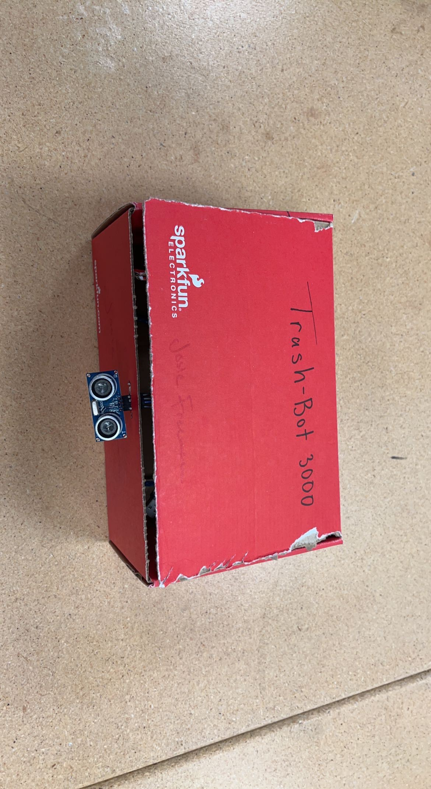
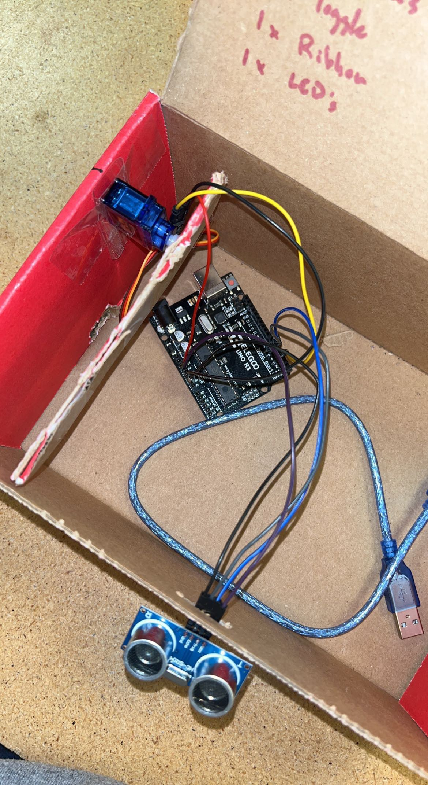

# Report by Titus Smith, Luke Barker, Jack Turner

## Planning, due on January 27th, 2023 by 9:30am

### Timeline

| Timeline  | Tasks |
| ----------- | ----------- |
|   Jan 31    |    Work on creating program |
|   Feb 1    |    Have an opperating code and start the hardware configuration |
|   Feb 3    |    Have trash can built, the phsyical structure of the trashcan, and start on adding hardware |
|   Feb 7    |    Add the completed hardware to the trashcan and work on adding code |

### Hardware

- Arduino board (Have)

- Servo Motor <https://www.amazon.com/Treedix-MG996R-Servo-High-Torque-Helicopter/dp/B08743N181/ref=sr_1_5?keywords=tower+pro+mg996r&qid=1674679467&sr=8-5> (Need)

- Motion Sensor <https://www.sparkfun.com/products/15569> (Need)

- Tape (if we go with cardboard box) (Need)

- Either a Cardboard Box or a 3D printed box

## Arduino Project

Describe the application you have chosen to develop and provide a motivation for why it is a useful application. Include  references of all sources you have used throughout this project (URLs are sufficient).

The application that we have chosen to develop is a motion censored trash can. This trashcan picks up motion in front of the  trashcan and then opens the lid for the user to throw away their garbage. It is a useful application because you can use it in the real world and it is similar to the trash cans that you open with your feet. This trash can allows you to not have to do any extra work and just lets you throw stuff away.

Here is the link to the website we used to help complete the wiring and create the code:
<https://projecthub.arduino.cc/ashraf_minhaj/c81effad-d583-40bb-9d20-808803efbdf2>

Below is an image from the tutorial that we used to base our wiring off of. The only difference we had was the port that has two wirings going into a singular port, we split those up and put the motor on the port with the lesser voltage.

## Agent

Explain the characteristics/attributes of your agent, what makes it an agent (within the discussed course content), what makes it rational, what type of an agent it is, and what is its environment task (PEAS).

Based on the definition of an agent, our trash can acts as an agent because it is acting based on its environment. Our trash can has sensors that allow it to react to the environment. It is self-aware because it has the motion sensors in the front and it is reactive and social behavior. These are all characteristics of agents that our trash can displays when being used. Our agent is a simple reflex agent because all it is doing is using the motion sensors to open the trash can with human interaction. Our agent would not be considered rational because it is only using sensors and isn't acting based on performance measures. The performance measure is how well the motor opens up the trash can and how safe it is. If the sensor is picking up motion when we want it to and then opens the trashcan efficiently, then that is a way we can evaluate the performance. The environment would be in peoples home's or rooms where the trash can is, and the area or situation right in front of the sensor. The actuators would be the lever that opens up the trash can, the motor that makes the lever work, all the wires, and the trashcan itself. The sensors would be the motion sensors that are in the front that open the trash can that pick up any motion.

## Challenges and Learning Experiences

Discuss any challenges you have encountered during the work on this lab and  describe what have you learned.

After working on this lab, the challenge of getting the code to work and figuring out how to put the trash can together helped us and taught us problem solving skills. It was a challenge to try and figure out how to change the code so that it could send the right signals to the motor to get it to turn the right way. We had an issue that we ran into when we started because we were using the wrong motor, and the tutorial had an interesting connection of the wires, so we had to work through that issue. We tries a new motor and wires in different ports and was able to get our agent to work. It was also a challenge to try and put the trash bot together and figure out where to put the Arduino board and the sensor and motor.

## Ethical Benefits and Implications

In this section, drawing on class discussions and readings, answer the following questions

1. What entities, businesses, organizations do you envision developing the type of the application you have chosen to develop?

A business that I could envision developing something like this would be a tech company or a company that deals with trash of some sort. A trash company could make this trash can to come out with a new product that maybe could excite consumers. A tech company could create something like this because they have the technology to do so and it could also make them a lot of money.

2. Who are the intended users of this technology?

The intended users of this technology are anyone who uses a trashcan. This is an agent that can be used by anyone and it could be a new creative way to have a trashcan in any area.

3. Who is not supposed to use this technology?

The only person who would not be allowed to use this technology would be someone that would not use it how it is supposed to be used or break it. This technology should be allowed to everyone who is going to use it the right way.

4. How can the application developed in this lab cause harm?

This application could cause harm because it might not be ethically sound. This agent requires movement and some people might not be able to use it they way that it is intended to be used.

5. What solutions could be implemented to avoid the harm or to fix the harm described above?

A solution to this harm would be to add other types of sensors so that it is usable by more people. By adding more sensors, it would allow people to use it using any of the sensors that are available.

## Team Work

Describe the details of your team working strategy, specifically explain how did you complete this work as a team and describe the specific contributions of each team member.

For this project, our team working strategy was to give members specific tasks and then help each other whenever we needed help with these tasks. Jack did most of the work when it came to the code and making minor changes to it so that it would do what we wanted it to. Titus and Luke worked on putting the box together and getting the trash can to work. Titus did the wiring part and mostly worked with the Arduino board and got that to connect with our sensors and our motor. Luke worked on the box and putting all of it together to get it to actually be a working trash can agent.
